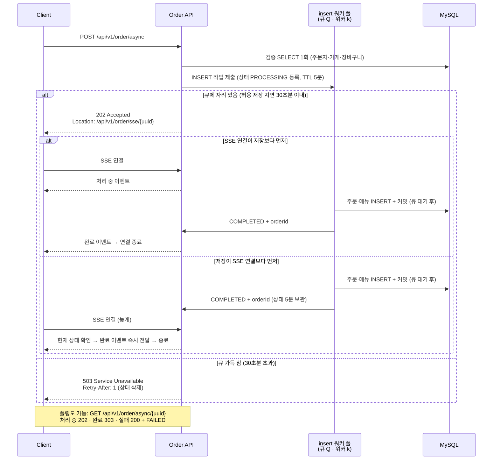

# 포트폴리오 1-2 초안 (2026-10-01, 측정 반영)

> 상태: **측정 완료.** 출처: 파일럿 `benchmark/results/2026-09-26-P1`·`2026-09-26-P2`, 격리 수준 `2026-09-29-ISO`, 포화 용량 `2026-09-29-CAP`(정정)·`2026-09-30-CAP2`, 선착순 `2026-09-30-FLASH`, 평상시 `2026-10-01-B`. 선착순 설계 `benchmark/DESIGN-promotion-stock.md`.
> 09-29 초안에서 크게 바뀌었다. "동기 2,680 vs 비동기 3,202건/s(+19%)"는 동기를 포화시키지 못한 측정이라 정정했고(동기 ≈ 비동기), 이벤트 시나리오는 선착순 한정 수량 할인으로 바뀌었다. 달라진 점은 맨 아래 표.

---
## 1-2. 선착순 한정 수량 주문: 재고 판정은 메모리 번호표로, 저장은 비동기 큐로 분리해 몰린 요청을 흡수

기간: 비동기 접수 구현 2025.07–08 → 거절 정책·트랜잭션·풀과 큐 재설계, 선착순 재고 설계·검증 2026.08–10

### 결과 요약

- 중소 배달앱(MAU 약 345만) 규모로 선착순 할인을 가정했다: 정각에 앱 전체 재고 10만 개, 시도 약 23만 건, 그동안 평상시 주문 초당 40건. 최고 초당 3,000건은 시나리오 실험용으로 가정한 몰림 모양이고, 서비스에 비동기가 필요하다는 근거가 아니다
- 재고 처리 3방식(DB 행 하나 · DB 여러 행 · 메모리 번호표)과 동기·비동기를 교차한 7개 비교군을 유효 3회씩 측정했다(무효 7회를 포함해 모두 28회). 28회 모두 초과 판매 0, 재고 보존(할인 주문 수 + 남은 재고 = 10만)
- **결정 1. 재고 판정은 메모리 번호표로 정했다.** 10만 건이 모두 확정된 시각(유효 3회 중앙값)은 DB 행 하나 89.7–90.0초 → DB 여러 행 52.5–56.7초 → 메모리 번호표 37.9–41.0초였다. 같은 재고 방식이면 동기·비동기 차이는 작았다. 메모리 방식은 10만 번째 시도가 도착하는 시각(정각 + 약 35.8초)에 거의 붙어 있었다
- **결정 2. 접수는 비동기를 택했다.** 측정한 구성 중 매진 전 거절이 없는 방식을 응답 요구보다 우선해 고른 것이다. 동시 처리 상한으로 거절하는 동기는 상한을 130에서 190으로 올려도 재고가 남은 동안 시도를 429로 돌려보냈다(상한 130: 9,279–15,418건, 상한 190: 6,215–13,393건, 10회 모두 매진 전). 상한이 없는 동기는 Tomcat 대기열에서 모두 늦어졌다(저장 완료 p95 1.48초, 평상시 주문 p95 0.74초). 비동기는 큐(7만 칸)에 받아 두어 매진 전 거절이 0이었다. 대신 응답과 확정은 상한 190 동기가 낫다(저장 완료 p95 중앙값 190ms, 요청 → 확정 평균 0.08초)
- 메모리 번호표 + 비동기 조합: 10만 건 확정 정각 + 37.9초, 매진 응답 p95 1.4ms, 확정 p99 0.96–2.42초. 비동기는 접수가 빠를 뿐 확정이 빠른 것은 아니다(요청 → 확정 평균 0.72초). 접수 p95 200ms 요구는 TCP 재전송이 가장 적은 회차에서만 지켰다(24ms, 나머지 두 회차 307·565ms). 요구를 만족하는 해결책으로 검증을 마친 것은 아니다
- **비동기는 처리량을 늘리지 않는다:** 할인 없는 일반 주문의 포화 처리량은 상한 없는 동기 3,283–3,320 · 비동기 3,157–3,388건/s로 범위가 겹쳤다. 비동기의 이득은 넘친 요청을 큐에 받아 두어 매진 전 거절 없이 받는 데 있다
- 평상시(초당 40건, 방식별 1회)에는 비동기가 확정을 앞당기지 않는다: 요청 → 확정 평균 동기 4.1ms, 비동기 약 4.3ms(접수 응답만 1.35ms로 빠름)
- 측정 중 찾아 고친 것: 거절이 DB 조회 뒤에 일어나던 결함(→ 대기 자리 선예약), 트랜잭션 2개(→ 1개, P=10에서 저장 처리량 +16–26%), 503이 연결을 끊어 초당 4,000건에서 붕괴(→ 429, 붕괴 3/3 → 0/2), 트랜잭션마다 붙던 격리 수준 전환 명령(→ 제거, 주문당 명령 9 → 6), 동기 용량을 낮게 잰 측정 방법(가상 사용자 200 → 400명)

### 문제 상황

- 선착순 할인은 정각 직후 1–2분에 시도가 몰린다. 최고 초당 3,000건(가정)이면 평상시의 약 75배다
- 지켜야 할 것: 초과 판매 0, 재고 보존, 1인 1회, 몰리는 동안에도 평상시 주문은 영향을 받지 않을 것
- 문제 1: 재고 10만 개는 앱 전체 이벤트 하나의 재고다. 이를 이벤트 재고 행 하나(`promotions.remaining_stock`)에서 차감하면, 어느 가게로 가는 주문이든 모든 할인 주문이 그 행의 잠금을 커밋까지 차례로 기다려 커밋이 하나씩만 된다. 주문은 가게 1,000곳에 흩어지고, 주문 경로는 가게 행을 잠그지 않는다
- 문제 2: 동기 처리에서는 처리량을 넘친 요청이 Tomcat 대기열에 쌓여, 할인 주문뿐 아니라 평상시 주문까지 늦어진다

### 목표치와 요구 (공개 자료로 계산한 가정)

| 항목 | 값 | 근거 |
|---|---|---|
| 규모 | MAU 약 345만 명 | 땡겨요 수준 (와이즈앱·리테일 2025년 10월) |
| 평상시 | 초당 약 40건 (저녁 피크) | 월 주문 = MAU × 5건, 17–21시에 70%, 피크는 평균의 1.5배 |
| 이벤트 | 앱 전체 재고 10만 개, 1인 1회, 시도 약 23만 명 | 푸시 발송 × 클릭률 상위 10% 6.7% (국내 커머스 푸시 자료) |
| 몰리는 모양 | 5초 만에 초당 3,000건 → 42초 유지 → 60초에 걸쳐 초당 300건 | 가정. 3,000건은 처음 잰 노트북 용량(동기 2,680 · 비동기 3,202건/s) 사이에 오도록 정했고, 정정한 용량(약 3,300건/s)으로 보면 그 아래다. 시나리오 실험용 값이며, 서비스에 비동기가 필요하다는 근거가 아니다 |
| 응답 | 성공·매진 p95 ≤ 200ms | LAN에서 잰 서버 측 값 |
| 확정 | 비동기 확정(저장 완료) p99 ≤ 30초 | SSE로 "처리 중"을 보여 주는 전제의 대기 한도 |
| 평상시 주문 | 이벤트 중에도 p95 ≤ 200ms | |
| 초과 판매 · 재고 보존 | 0건 · 할인 주문 수 + 남은 재고 = 10만 | |

### 설계

**1. 재고 판정: 메모리 번호표 + DB 안전망**
- 접수 단계에서 메모리 발급기가 번호표(1–10만)를 준다. 다 나가면 DB에 가지 않고 즉시 409 SOLD_OUT, 같은 사용자의 예약이 있으면 즉시 409 ALREADY_JOINED
- 최종 보증은 DB가 한다. 참여 행의 번호표는 유니크 + 번호표 테이블 외래 키라 메모리에 버그가 있어도 10만 건을 넘을 수 없고, 1인 1회는 참여 기본 키(이벤트, 사용자)가 막는다
- 실패한 주문의 번호표를 발급기에 반납하는 조건은 "그 주문이 DB에 확실히 없다"뿐이다
- 비교한 DB 방식: 행 하나(조건부 차감 UPDATE), 여러 행(재고를 20행으로 나눠 분산. 행 수는 20 한 가지로만 쟀다). 여러 행은 이 경로만 READ COMMITTED다 — 기본 격리 수준에서는 조건이 안 맞는 빈 행의 잠금이 남아 교착이 실제로 났다. 그래서 트랜잭션당 명령이 약 9.0–9.6개로 메모리 방식(6.85개)보다 많다

**2. 접수와 저장 분리 (비동기)**
- 접수(요청 스레드, DB 없음): 대기 자리 예약(큐 칸 수 세마포어) → 번호표 예약(메모리 방식만) → 상태 등록(Caffeine, TTL 5분) → 워커 제출 → 202 + Location. DB 방식의 비동기는 재고를 워커가 판정한다
- 저장(워커, 트랜잭션 하나): 검증 SELECT + 주문·메뉴 INSERT + 참여 INSERT. 결과는 불변 상태 객체로 교체해 COMPLETED + 주문 id 또는 FAILED가 함께 보인다
- 큐가 차면 요청 스레드에서 몰래 실행하지 않고(CallerRunsPolicy 미사용) 429 + Retry-After 1로 거절한다
- 상태 전달: SSE + 폴링(처리 중 202, 완료 303, 실패 200 + FAILED)

> TODO: 그림 갱신 필요(거절 503 → 429, 검증 위치가 접수 → 워커, 대기 자리 예약·번호표 예약 단계 추가).

**3. 풀과 큐 크기: 공식에서 출발해 측정으로 확정**

| 값 | 출발점 | 측정 | 확정 |
|---|---|---|---|
| 커넥션 P | 코어 × 2 + 1 ≈ 10 | 워커와 함께 20까지 늘리면 비동기 처리량 +35% (P2) | **20** |
| 저장 워커 k | 커넥션 예산 안 | k = P = 20에서 최대 2,943건/s, P=15·k=15는 93.2% | **20** |
| 대기 큐 Q | 저장 처리량 × 허용 지연 30초 × 0.8 | 파일럿 저장 처리량 2,943건/s × 24초 | **70,000칸** |

### 측정하며 바꾼 것

**1. 거절이 DB 조회 뒤에 일어나던 결함**
- 발견: 과부하 회차에서 거절 응답도 p95 0.3–0.8초였고, 회차당 거절 로그가 32만–38만 줄 남았다
- 원인: 접수 트랜잭션(커넥션 획득 → 검증 SELECT)을 마친 뒤에야 큐가 찼는지 알았다. 어차피 거절될 요청이 커넥션과 쿼리를 써서 받은 주문까지 느려졌다
- 수정: 트랜잭션 전에 대기 자리를 예약하고 건별 로그를 없앴다. 거절 요청의 쿼리 0회를 테스트로 고정했다(Hibernate 통계)

**2. 트랜잭션 2개 → 1개 (접수의 검증을 워커의 저장 트랜잭션으로 합침)**
- 같은 조건(P=10·k=6, 초당 2,250건)에서 저장 처리량 1,559 → 1,959건/s(+26%), 접수 p95 70.1 → 6.0ms, 주문당 MySQL 명령 15 → 9개. 초당 2,700건 격자에서 P=10의 같은 k끼리는 +16–18%였다(P=15·k=10은 split의 접수가 커넥션을 기다려 +38%)
- 실제 일(검증 SELECT 1 + INSERT 2)은 같고, 트랜잭션마다 부가 명령이 약 6개 붙었다. 나눈 구성은 접수도 커넥션을 써서 워커를 늘릴수록 접수가 커넥션을 기다렸다
- 대가: 잘못된 주문도 202를 받은 뒤 FAILED가 된다

**3. 거절 응답 503 → 429**
- 발견: 초당 4,000건에서 서버가 응답을 1–5초씩 멈추며 무너졌다. CPU·GC로는 설명되지 않았다
- 원인: Tomcat은 503 응답 뒤 연결을 끊는다. 거절이 초당 800건을 넘자 거절된 클라이언트가 모두 새 연결을 맺어(초당 824–1,051개) 서버가 연결 수립에 매달렸다
- 확인: 초당 4,000건에서 응답 코드만 바꿔 503은 3회 모두 붕괴, 429는 2회 모두 버팀(새 연결 초당 44–45개). 거절이 적은 초당 3,000건에서는 응답 코드에 따른 차이가 없었다. 앞에 프록시를 두면 클라이언트에 보일 코드는 거기서 바꾼다

**4. 격리 수준 지정 제거**
- 코드의 READ COMMITTED 지정이 트랜잭션마다 SET 2개 + SELECT 1개를 붙였다. 지정을 빼 주문당 명령 9 → 6개, 접수 p95 6.3–8.3 → 3.2–3.6ms(비동기 일반 주문, 초당 2,000건). 읽기가 검증 SELECT 하나뿐이라 격리 수준 자체의 결과 차이는 없었다

**5. 측정 방법 정정: 동기 용량을 낮게 쟀던 것**
- 처음에는 동기를 closed 가상 사용자 200명으로 재 2,680건/s로 보고, 비동기(3,202건/s)가 19% 많이 저장한다고 봤다. 선착순에서 빠른 거절 없는 동기가 비동기와 같은 속도로 매진된 것을 보고 다시 확인하니, Tomcat 바쁜 스레드가 200개 중 평균 68–86개로 서버를 다 채우지 못했다
- 가상 사용자 400명으로 다시 재니 동기 3,283–3,320건/s로 비동기와 범위가 겹쳤다. 결론을 내기 전에 부하가 서버를 포화시켰는지(바쁜 스레드·커넥션)부터 확인하도록 절차를 바꿨다

### 검증 방법

| 항목 | 값 |
|---|---|
| 장비 | 데스크톱 k6(가상 사용자 상한 4,000) → 유선 100Mbps → 노트북 Spring Boot + MySQL 8.0.37 (i7-1165G7, RAM 16GB) |
| 비교군 | 재고 3방식 × 접수 2방식(빠른 거절 동기·비동기) = 6개에, 빠른 거절 없는 동기 × 메모리 1개를 더한 7개 |
| 빠른 거절 동기 | 동시 처리 수가 상한을 넘으면 재고를 보기 전에, 기다리지 않고 바로 429. 처음 상한 130은 정정 전 동기 용량(2,680건/s × 허용 대기 50ms)으로 잡은 값이라 정정 뒤 기준(약 165)보다 낮다. 그래서 10-02에 상한 190(Tomcat 스레드 200 − 거절 응답용 여유 10, 포화 용량 측정과 같은 값)으로 다시 쟀다. k6는 429를 다시 시도하지 않는다 |
| 반복 · 순서 | 비교군마다 유효 3회(21회), 무효 7회를 포함해 모두 28회. 10-02에 상한 190 빠른 거절 동기 · 메모리 3회(29–31회차, 모두 유효)를 더했다. 바퀴마다 순서를 바꿔 시간대 효과를 나눔. 회차 사이 15분 휴식 |
| 절차 | 서버 재시작 → 워밍업 → 초기화 → 측정 → 큐 소진 → DB 대조 (참여 ≤ 재고, 남은 재고 + 참여 = 재고, 번호표 중복 0, 결과 모름 0) |
| 유효 기준 | 부하기 CPU 평균 80% 미만(80% 이상 2표본 연속 없음), k6 연결 실패·5xx가 시도의 0.1% 이하. 처음 기준은 0건이었고 측정 중에 0.1%로 바꿨다. 이 변경으로 비동기·메모리 1회, 비동기·DB 여러 행 2회가 유효가 됐고, 0건 기준으로 봐도 순위는 같다 |
| 지표 | 사용자 관점: 10만 건이 모두 확정된 시각, 요청 → 확정 시간, 매진을 알게 되는 시점. 서버: 큐·커넥션·스레드 1초 기록, 제출 → 커밋 히스토그램 |

### 결과

**선착순 (유효 3회 중앙값)**

| 비교군 | 10만 건 확정 (정각 기준) | 성공 응답 p95 | 요청 → 확정 평균 | 매진 통보 | 평상시 주문 p95 | 돌려보낸 요청 |
|---|---|---|---|---|---|---|
| 동기 · DB 행 하나 | 90.0초 | 211ms | 0.11초 | 즉시 | 96ms | 429: 시도 약 12.0만 · 평상시 1,998건 |
| 동기 · DB 여러 행 | 56.7초 | 301ms | 0.10초 | 즉시 | 48ms | 429: 시도 약 6.1만 · 평상시 800건 |
| 동기 · 메모리 | 41.0초 | 232ms | 0.07초 | 즉시 | 27ms | 429: 시도 약 1.4만(9,279–15,418, 모두 매진 전) · 평상시 202건 |
| 동기 · 메모리, 상한 190 (10-02) | 40.6초 | 190ms | 0.08초 | 즉시 | 48ms | 429: 시도 약 1.3만(6,215–13,393, 모두 매진 전) · 평상시 169건 |
| 동기(빠른 거절 없음) · 메모리 | 39.1초 | 1,480ms | 0.90초 | 즉시 | 740ms | 보내지 못함 4,731건 (가상 사용자 상한) |
| 비동기 · DB 행 하나 | 89.7초 | 8.7ms (202) | 26.1초 | 202 뒤 30.4초 | 2.2ms (202) | 429: 시도 약 5.1만(큐 가득) · 평상시 1,043건 |
| 비동기 · DB 여러 행 | 52.5초 | 610ms (202) | 7.6초 | 202 뒤 10.7초 | 32ms (202) | 보내지 못함 8,495건 |
| **비동기 · 메모리 (선택)** | **37.9초** | 307ms (202) | 0.72초 | **즉시** | **15ms (202)** | **0** |

- 성공 응답 p95는 동기는 저장 완료(200), 비동기는 접수(202)라 뜻이 다르다. 비동기의 확정은 "요청 → 확정"으로 본다
- 매진 통보의 "202 뒤" 값은 중앙값(p50), 요청 → 확정은 평균이다
- 평상시 주문 p95는 측정 전체(약 437초)에 걸친 값이다. 몰리는 구간만 따로 재지 않았고, 비동기 값은 접수 응답이라 확정 지연은 들어 있지 않다

**포화 용량 (할인 없는 일반 주문, 3분):** 상한 없는 동기 3,283 · 3,320, 비동기 3,302 · 3,388(09-29 3,248 · 3,157), 빠른 거절 동기(상한 190) 3,191 · 3,086건/s
**평상시 (초당 40건, 15분, 방식별 1회):** 동기 응답(= 확정) 평균 4.1ms · p95 4.8ms, 비동기 접수 평균 1.35ms · p95 1.8ms, 요청 → 확정 평균 약 4.3ms(결과를 SSE·폴링으로 받는 시간 제외). 둘 다 거절·실패 0

### 해석과 선택

**결정 1. 재고 판정: 메모리 번호표 (근거가 가장 강하다)**
- 10만 건 확정 시각의 차이는 동기·비동기가 아니라 재고 방식에서 났다. 비교군·회차마다 순서가 같았다
- DB 방식은 서버가 정했다. DB 행 하나는 커밋이 하나씩만 돼(주문당 fsync 약 4회) 초당 확정 약 1,200건에 묶였다
- 메모리 방식은 10만 번째 시도가 도착하는 정각 + 약 35.8초에 거의 붙어 있다. 사실상 시도가 들어오는 속도가 정했고, 메모리 방식에 남은 서버 여유는 재지 못했다
- 비동기 + DB 방식은 사용자를 기다리게 한다. 202는 빨라도 확정까지 평균 7.6초(여러 행)·26.1초(행 하나)이고, 매진을 202 뒤 중앙값 10.7초·30.4초에 FAILED로 안다. 비동기 + DB 행 하나는 큐 70,000칸이 차서 시도 4.9–5.2만 건을 429로 돌려보냈고, 확정 p99가 약 59초로 요구(30초)를 넘었다. 비동기를 쓸 거면 재고 판정은 접수 단계에서 끝내야 한다

**결정 2. 접수: 비동기 (근거를 구조적인 차이로 한정한다)**
- 같은 메모리 방식에서 접수 방식별 확정 시각은 비슷했다(비동기 37.9초, 상한 없는 동기 39.1초, 빠른 거절 동기 상한 190 40.6초·상한 130 41.0초). 이 몇 초 차이는 처리 속도가 아니라, 429나 미전송으로 빠진 시도만큼 뒤에 온 사람이 사야 했던 결과다. 차이는 넘친 요청을 다루는 방식이다
- 상한 없는 동기는 넘친 요청이 Tomcat 대기열에 쌓여 모두가 늦어졌다(저장 완료 p95 1.48초, 평상시 주문 0.74초). 부하기가 가상 사용자 상한에 닿아 4,683–7,758건은 보내지도 못해, 실제 지연은 이보다 길 수 있다
- 빠른 거절 동기는 동시 처리가 상한을 넘는 순간 재고가 남아 있어도 거절한다. 상한 130에서는 429가 7회(무효 4회 포함) 모두 매진 전에 났다(유효 3회: 시도 9,279–15,418건, 평상시 주문 120–208건). 상한을 정정한 용량 기준에 맞춰 190으로 올려 다시 잰 3회(10-02)도 시도 6,215–13,393건(중앙값 13,312건)과 평상시 주문 85–190건을 매진 전에 거절했다. 1초 기록상 바쁜 스레드가 190 이상인 시점이 회차마다 4–16초 있었다. 거절된 사람은 다시 시도해야 하고, 재고가 남은 동안 먼저 온 사람이 거절되고 나중에 온 사람이 산다
- 대신 상한 190 동기는 응답과 확정이 가장 좋았다: 저장 완료 p95 중앙값 190ms(178–324ms, 3회 중 2회 200ms 이내), 요청 → 확정 평균 0.08초
- 비동기는 큐(7만 칸)에 받아 두어 매진 전 거절이 0이었다. 대신 접수가 빠를 뿐 확정이 빠른 것은 아니다(요청 → 확정 평균 0.72초). 그래서 결정 2는 "측정한 구성 중 매진 전 거절이 없는 방식을 응답 요구보다 우선해 택했다"는 판단이다. 응답·확정은 상한 190 동기가 낫고, 비동기의 접수 p95 요구는 유효 3회 중 1회만 충족해 검증을 마치지 못했다

**요구 충족**
- 초과 판매 0과 재고 보존은 28회 모두 지켰다
- 성공 응답 p95 ≤ 200ms: 비동기 + 메모리는 TCP 재전송이 가장 적은 회차(초당 3건)에서만 지켰다(24ms). 재전송이 초당 75–78건이던 두 회차는 307·565ms였고, 재전송이 많아진 원인은 확인하지 않았다. 빠른 거절 동기는 상한 130에서 재전송이 적은 회차(초당 5건)만 154ms로 지켰고, 상한 190에서는 3회 중 2회(190·178ms) 지켰다
- 비동기 + 메모리의 나머지 요구: 확정 p99 0.96–2.42초, 평상시 주문 p95 4.9–15.6ms, 매진 응답 p95 3.8ms 이하로 지켰다
- 1인 1회는 부하 측정에서 시도마다 다른 사용자를 보내 시험하지 않았다. 테스트와 참여 기본 키(이벤트, 사용자)로 보장한다

**평상시**
- 평상시(초당 40건)에는 비동기가 확정을 앞당기지 않는다. 접수 응답은 1.35ms로 동기(4.1ms)보다 빠르지만 확정까지는 약 4.3ms로 같고, 결과를 SSE·폴링으로 받는 시간이 더 붙는다. 비동기는 속도가 아니라 몰리는 순간을 위한 선택이다

### 한계 및 후속 개선

- 번호표·큐·상태가 프로세스 메모리에 있다. 재시작하면 202를 받은 주문이 유실될 수 있고(초과 판매는 DB 제약이 막는다) 서버 한 대가 전제다. 운영 전에 영속 큐(메시지 큐·Outbox)와 공유 재고 카운터(예: Redis)가 필요하다
- 비동기의 거절 0은 최고 유입 초당 3,000건에서 관찰한 결과다. 이때 큐는 최대 1,776–3,436칸(7만 칸의 5% 이하)만 찼다. 큐가 차면 비동기도 재고와 상관없이 429를 준다. 유입이 저장 처리량을 크게 넘는 몰림은 재지 않았다
- 검증이 저장 단계에 있어 잘못된 주문도 202 뒤 FAILED가 된다. 클라이언트는 SSE·폴링 결과로 실패를 안내해야 한다
- 빠른 거절 동기는 선착순에서 상한 130·190 두 값만 쟀다. 상한을 더 올리면 거절 수는 줄겠지만 응답 지연은 상한 없는 동기 쪽으로 늘어날 것으로 본다(재지 않음)
- 접수 p95 ≤ 200ms 요구는 유효 3회 중 1회만 지켰다. 재전송이 많은 시간대의 회차는 307–565ms였고, 재전송이 많아진 원인은 확인하지 않았다
- 재시도 때 중복 주문을 막는 멱등 키가 없다
- 측정한 코드(`b328abf`)의 주문 검증은 장바구니 소유·가게 일치 확인이 주석 처리된 상태였다(`7732962`에서 되살렸다). 검증 SELECT의 대상 행과 횟수는 같지만, 되살린 코드로 다시 재지는 않았다
- 노트북 한 대에 앱과 MySQL이 함께 있고, 부하기는 가상 사용자 4,000개가 상한이다

### 느낀 점

- "비동기는 빠르다"는 가정을 측정이 깼다. 처리량은 같았고, 차이는 넘친 요청이 어디서 기다리느냐였다
- 병목은 처리 방식이 아니라 재고 행 하나였다. 구조를 바꾸기 전에 어디서 줄을 서는지부터 재야 한다
- 처음 잰 동기 용량이 틀린 것은 부하가 서버를 다 채우지 못해서였다. 숫자를 믿기 전에 그 숫자가 무엇을 쟀는지부터 확인해야 한다

---

## 이전 초안(2026-09-29) 대비 변경

| 이전 | 지금 |
|---|---|
| 이벤트 S(일반 주문 스파이크, 10만·20만 명) | 선착순 한정 수량 할인(앱 전체 재고 10만 개, 시도 약 23만 건, 최고 초당 3,000건) 7개 비교군 × 유효 3회 |
| 동기 2,680 vs 비동기 3,202건/s(+19%), 차이는 커밋 묶음 | 동기 3,283–3,320 · 비동기 3,157–3,388건/s로 범위가 겹침. 09-29 동기는 포화가 아니었다(Tomcat 바쁜 스레드 평균 68–86/200) |
| 비동기를 고른 근거: 순간 유입 흡수(처리량 차이 포함) | 처리량이 같으므로 근거는 넘친 요청을 받아 두는 것: 매진 전 거절 0. 응답·확정은 상한 190 동기가 낫다는 점을 함께 적음 |
| 재고 처리 없음 | 재고 3방식 비교, 메모리 번호표 + DB 안전망(유니크·외래 키) 채택 |
| B·A·S `[측정값]` | B는 방식별 1회 측정(평상시 확정 시간은 같음), A는 포화 용량 재측정으로 대신, S는 선착순으로 대체 |
| 빠른 거절 상한 130(2,680건/s × 50ms) | 130은 낮게 잡힌 값으로 정정(실제 용량 기준이면 약 165). 포화 용량 측정은 190 |
| "측정하며 바꾼 것" 3가지 | 격리 수준 지정 제거, 측정 방법 정정(동기를 포화시키지 못한 것)을 더해 5가지 |
| (10-02) 상한 130 비교만으로 비동기 필요성을 넓혀 씀, "평상시 주문 보호"·"선착순 순서 유지"·거절 0의 원인 단정 | 상한 190 선착순 3회를 더 재 결과를 넣고, 판단을 "매진 전 거절 0을 응답 요구보다 우선한 선택"으로 한정. 평상시 주문은 전체 구간 접수 응답으로, 순서는 "매진 전 거절 0"으로, 거절 0은 관찰 사실로 고침 (`REVIEW-2026-10-01-feedback.md`) |
| (10-01 첫 반영) 결과 표의 응답 열에 202와 200이 섞임, 한계 일부 누락 | 열에 202·200을 표시하고 "돌려보낸 요청" 열을 더함. 비동기 거절 0의 조건, 유효 기준 변경, 측정 코드의 검증 상태를 한계·검증 방법에 적음 (2026-10-01 검토 반영) |

### 그 전(2026-09-26) 초안 대비 변경

| 이전 | 지금 |
|---|---|
| 부하가 모두 W의 배수(0.5W, 2W) | 트래픽 목표치(중소 앱: 평상시 40, 이벤트 10만·20만 명)에서 출발 |
| 검증은 접수 경로(동기), 저장만 워커 | 검증 + 저장을 워커 트랜잭션 하나로(`single`, +26%) |
| 거절 503, 검증 SELECT 뒤 | 429, 트랜잭션 전 자리 예약으로 DB 없이 즉시 |
| 풀·큐 `[P]`·`[k]`·`[Q]` 자리표시 | P=20, k=20, Q=70,000 (실측으로 확정) |
| 비교군 동기 하나 | 동기 + 동기 빠른 거절(동시 처리 상한 120 → 용량 재측정 뒤 130) |
| 동기 용량 약 2,360건/s (P1, 가상 사용자 64명) | 2,680건/s (최종 코드, 가상 사용자 200명). 비동기 3,202건/s, +19% → 09-30 정정: 200명도 포화가 아니었다(위 표) |
| C 지속 초과 회차 | 보류(중소 앱 목표에서는 저녁 피크가 용량을 넘지 않음) |
| 한계 "거절이 검증 SELECT 뒤" | 해결됨(자리 선예약) |
